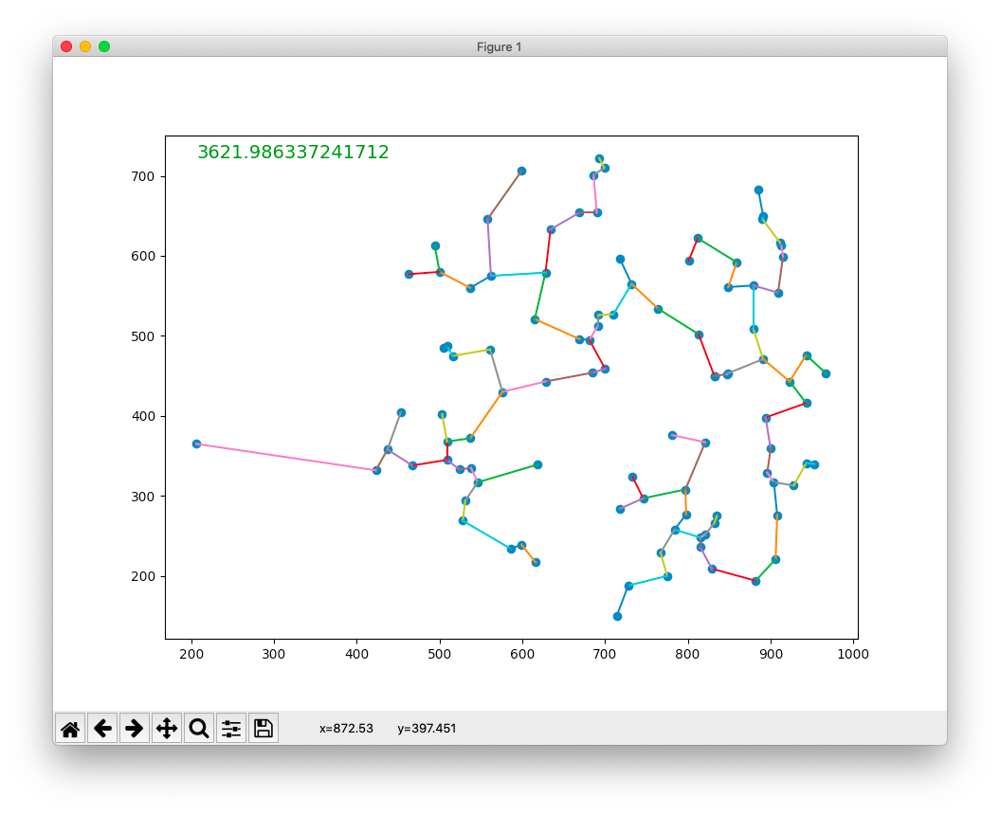

copy or link `sol.txt` in this location.
It's the *list of successors* (one list per line)
to describe the solution tree. The format for each line is
```
xp,yp:xp1,yp1[;...]
or
xp,yp:
```

install requirements,
my choice is to use venv module
for separation with python's system installation
```
python3 -venv env
./env/bin/pip install --upgrade pip
./env/bin/pip install -r requirements.txt
```

run
```
./env/bin/python
```

enjoy your score :)



above the demo with kruskal algorithm for minimum spanning tree of `example/input.points`
